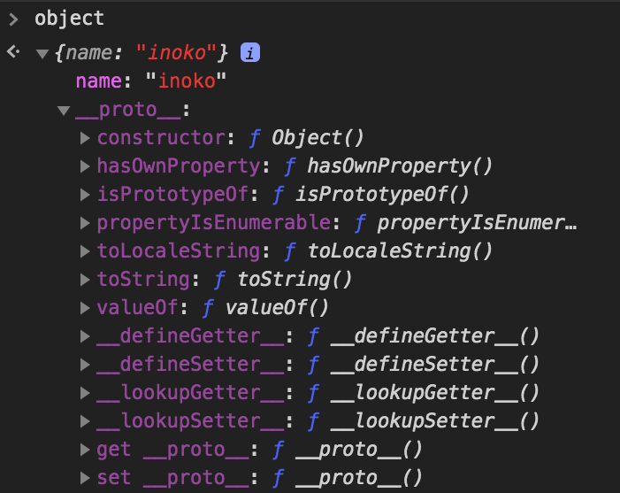
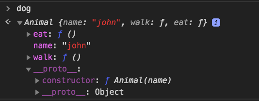

<!-- $theme: default -->

# JavaScript の プロトタイプチェーン について理解する

## 目的：**JavaScriptの基本言語仕様について理解を深める**

近年、フロントエンド開発ができるエンジニアが少しずつ増えてきています

フレームワーク（Vue, React）の書き方は知っているけれど、Javascript の基本的な言語仕様についてはあまり知らない人が増えているので

そんな人と、そうでもない人（＝つまり全員）に向けたのおさらい

また、フロントエンドエンジニアのプロパーとして知っておくべき内容

## プロトタイプってなに

Chromeのコンソールで以下を実行してみてください

```javascript
var object = {
  name: 'inoko'
};
```

オブジェクトをリテラル（直書き）で生成するだけです

そのオブジェクトを参照してみてください


`__proto__` というオブジェクトがなぜか生成されています

フロントエンドの開発経験があるエンジニアなら、一度は見たことがある光景でしょう

👇 展開してみた




いろんなメソッドを持っていますが、見覚えはありませんか？

例えば `hasOwnProperty` とか `toString` とか。

この **`__proto__` オブジェクトが、プロトタイプです**


## 一体どこから来たの・・？

継承（extends）されて、やって来ました

継承元は？

```javascript
window.Object.prototype
```

確認のため、比較してみる


同じですね

この `window.Object` は JavaScript の標準ビルトインオブジェクトになっています

MDN によると、継承の仕組みは以下のように説明されています

>JavaScript におけるすべてのオブジェクトは Object に由来します。
>すべてのオブジェクトは Object.prototype からメソッドとプロパティを継承しています

つまりJavaScriptでは、生成されたオブジェクトすべてにおいて

`window.Object.prototype` から継承されたプロトタイプを `__proto__` という名前で持ちます


## Array や String, Number の場合はどうなの？

実際にやってみましょう

まずは、生成して

```javascript
var array = ['a', 'b', 'c'];
```

参照して、展開してみる


`__proto__` いた

`forEach` `pop` `push` など、配列を扱うときによく使う method が並んでいますね

勘のいい人はわかると思いますが

Array は `window.Array.prototype` というオブジェクトを継承しています


String や Number も同様です

<!--  -->


このように

**すべてのJavaScriptオブジェクトには、もう一つの別のオブジェクトが関連付けられています**

この **もう一つの別のオブジェクトを、プロトタイプと呼びます**

言い換えると

**すべてのJavaScriptオブジェクトは、プロトタイプを持ちます**

注）null の場合を除く

以下の場合は、プロトタイプを持ちません

```JavaScript
var nullObject = Object.create(null);
```


## ここで質問

例えば、こんな処理をしたことはありませんか？

```javascript
var array = ['a', 'b', 'c'];
array.push('d');
```

`array` という変数には、 `push` というプロパティやメソッドを定義してないのに、どうして使えるのでしょう？？🤔


ここで `プロトタイプチェーン` が出てきます


## プロトタイプチェーン

以下を実行すると

```javascript
array.push('d');
```

① `array` という変数に `push` というプロパティやメソッドがないかどうか調べる

　 `array` には `['a', 'b', 'c']` という値しか代入していないので、もちろんないです

② なかった場合、`__proto__` が参照する先を調べる

　ここで、配列のプロトタイプの継承元である `window.Array.prototype` の先を見に行きます

　今回の例では、ここで `push` が見つかり、実行されます

　ちなみに、

③ `__proto__` になかった場合、さらに遡って `__proto__` の先へ先へと、永遠と調べ続ける

④ `__proto__` が存在しなくなるまで探したが見つからない場合、 `undefined` を返す


　このように、`__proto__` は鎖のように連鎖的に繋がっています

　この **プロトタイプの連鎖のことをプロトタイプチェーン** と呼びます

　もし、何らかのプロパティやメソッドが参照できなかった場合は、プロトタイプチェーンの最終リンクで見つからなかった、という事になります

　何かの値を参照するときは毎回、 **プロトタイプチェーンを遡っています**


## 他のパターン

以下の場合を考えてみましょう

```javascript
var object = {
  age: 20
};
console.log(object.name); // undefined
```

① 変数 `object` に `name` が存在するかどうか調べる

　ないので、次は

② `object.__proto__` が参照する先を調べる

　オブジェクトのプロトタイプは `window.Object.prototype` でしたね

　こちらにも、 `window.Object.prototype.name` は存在しません

　ですので、さらに遡ろうとします

③ `object.__proto__.__proto__` があるか調べる

④ `object.__proto__.__proto__` が存在しないので `undefined` を返す


## プロトタイプチェーンは実際にどこで使われているか

ES6 が登場して、JavaScriptがClass構文に対応しましたが

ES6 に対応していないブラウザ（IEとか）や、Class構文が登場する前は、どのように実装されていたのでしょうか？

### `Babel` で Class構文をコンパイルしてみる

以下のシンプルな `Animal Class` を `Babel` に通してみます

```javascript
/**
  Animal クラス
  **/
class Animal {
  constructor(name) {
    this.name = name;
  }

  walk() {
    console.log('walk method.');
  }

  eat() {
    console.log('eat method.');
  }
}

// Animal Class から dogインスタンス を作る
var dog = new Animal('John');
dog.walk(); // walk method.
dog.eat(); // eat method.

```

⬇︎ Babel を通す

```javascript
"use strict";

function _instanceof(left, right) { if (right != null && typeof Symbol !== "undefined" && right[Symbol.hasInstance]) { return !!right[Symbol.hasInstance](left); } else { return left instanceof right; } }

function _classCallCheck(instance, Constructor) { if (!_instanceof(instance, Constructor)) { throw new TypeError("Cannot call a class as a function"); } }

function _defineProperties(target, props) { for (var i = 0; i < props.length; i++) { var descriptor = props[i]; descriptor.enumerable = descriptor.enumerable || false; descriptor.configurable = true; if ("value" in descriptor) descriptor.writable = true; Object.defineProperty(target, descriptor.key, descriptor); } }

function _createClass(Constructor, protoProps, staticProps) { if (protoProps) _defineProperties(Constructor.prototype, protoProps); if (staticProps) _defineProperties(Constructor, staticProps); return Constructor; }

/**
  Animal クラス
  **/
var Animal =
/*#__PURE__*/
function () {
  function Animal(name) {
    _classCallCheck(this, Animal);

    this.name = name;
  }

  _createClass(Animal, [{
    key: "walk",
    value: function walk() {
      console.log('walk method.');
    }
  }, {
    key: "eat",
    value: function eat() {
      console.log('eat method.');
    }
  }]);

  return Animal;
}(); // Animal Class から dogインスタンス を作る


var dog = new Animal('John');
dog.walk(); // walk method.

dog.eat(); // eat method.

```

今回の説明に不要そうなメソッドは取り除いてみます

```javascript
/**
 * プロパティを定義する
 */
function _defineProperties(target, props) {
  for (var i = 0; i < props.length; i++) {
    var descriptor = props[i];
    descriptor.enumerable = descriptor.enumerable || false;
    descriptor.configurable = true;
    if ("value" in descriptor) {
      descriptor.writable = true;
    }
    Object.defineProperty(target, descriptor.key, descriptor);
  }
}

/**
 * クラスを作る
 */
function _createClass(Constructor, protoProps) {
  if (protoProps) {
    _defineProperties(Constructor.prototype, protoProps);
  }
  return Constructor;
}

/**
  Animal クラス
  **/
var Animal =
/*#__PURE__*/
function () {
  function Animal(name) {
    this.name = name;
  }

  _createClass(Animal, [{
    key: "walk",
    value: function walk() {
      console.log('walk method.');
    }
  }, {
    key: "eat",
    value: function eat() {
      console.log('eat method.');
    }
  }]);

  return Animal;
}();

// Animal Class から dogインスタンス を作る
var dog = new Animal('John');
dog.walk(); // walk method.
dog.eat(); // eat method.
```

みてみると、 `prototype` を使っていますね

さらに、読みやすいように簡略化してコメントを書いてみます


```javascript
/**
  Animal クラス
  **/
var Animal = function () {
  function Animal(name) {
    this.name = name;
  }

  // walk メソッドを定義
  Animal.prototype.walk = function() {
    console.log('walk method.');
  }
  // eat メソッドを定義
  Animal.prototype.eat = function() {
    console.log('eat method.');
  }

  return Animal;
}();

// Animal Class から dogインスタンス を作る
var dog = new Animal('John');
dog.walk(); // walk method.
dog.eat(); // eat method.
```

この状態が、JavaScriptのES5以前の仕様でクラスを実現しようとした時の書き方です

ES6 の Class構文 もあくまでラッパーなので、内部的にブラウザはこのように解釈しています


注目すべきは **`walk`,`eat` メソッドを `prototype` のメンバーに持たせている** というところです

ここで、`new` したあとの `dogインスタンス` の中身を見てみましょう


`eat` `walk` メソッドはそれぞれ

`dog.__proto__.eat` `dog.__proto__.walk` プロトタイプに定義されています

以下を実行したときは、プロトタイプチェーンを遡り、`dog.__proto__.walk` を実行することになります

```javascript
dog.walk(); // walk method.
```


### なぜメソッドを `prototype` のメンバーに持たせる必要があるか

仮に、`prototype` ではなく 以下のように実装するとします

```javascript
/**
  Animal クラス
  **/
var Animal = function () {
  function Animal(name) {
    this.name = name;

    this.walk = function() {
      console.log('walk method.');
    }

    this.eat = function() {
      console.log('eat method.');
    }
  }

  return Animal;
}();

// Animal Class から dogインスタンス を作る
var dog = new Animal('John');
dog.walk(); // walk method.
dog.eat(); // eat method.

```

`this` は `Animal` を指すので、プロトタイプに値を持たせるのではなく

`Animal.walk` のように `Animal` の直下にメソッドを定義します

この状態でも、得られる結果は先ほどと、同様です

ここで、 new された後の `dogインスタンス` の中身を見てみましょう



`dog.__proto__.eat` ではなく、new した `dog` の直下に定義されていますね


ここで、以下のように大量に `new` した場合を考えましょう

```javascript
var dog = new Animal('John');
var cat = new Animal('Emma');
var rabbit = new Animal('Olivia');
var tiger = new Animal('Ava');
var pig = new Animal('Isabella');
var squirrel = new Animal('Sophia');
var horse = new Animal('Charlotte');
// ...more
```

この場合、 `walk` `eat` メソッドが、`new` するたびにメモリ空間を消費することになります

もし `prototype` を使っていた場合は、**継承元のメソッドのみでしかメモリを消費しません**

つまり **メモリの無駄遣いを防ぐために、プロトタイプ、プロトタイプチェーンの仕組みが使われています**


## (おまけ) なぜ `for in` は使うとき注意すべきか


### 理由: `for in` は `prototype` まで遡ってループするから

例えば
```

```


<!-- --------------- 違う話かも --------------
## プリミティブ型とオブジェクト型

Premitive＝現式的な

プリミティブ型：Number, Boolean, String, null, undefined
オブジェクト型：その他オブジェクト

>object 型をのぞく全ての型は不変 (immutable) な値 (変更することができない値) として定義されています。特筆すべき点としては、 string 型が（Cなどとは違って）不変な値である点です。これらの型の値を、プリミティブ値 (primitive value) と呼びます。詳細は Strings の節で触れることとします。
 -->


## 参考

prototypeをもたないオブジェクト
https://qiita.com/yoshiwatanabe/items/338705a20e8475e4057e

プリミティブ型とオブジェクト
https://murashun.jp/blog/20190401-08.html

JavaScriptはオブジェクトについて参照渡しだなんて、信じない
https://qiita.com/mozisan/items/1b9d4bf5a1bb341dd354

JavaScript のデータ型とデータ構造
https://developer.mozilla.org/ja/docs/Web/JavaScript/Data_structures#Strings<br />

C言語　文字列
https://www.cc.kyoto-su.ac.jp/~yamada/programming/string.html


Babel https://babeljs.io/

https://html5experts.jp/takazudo/17355/
